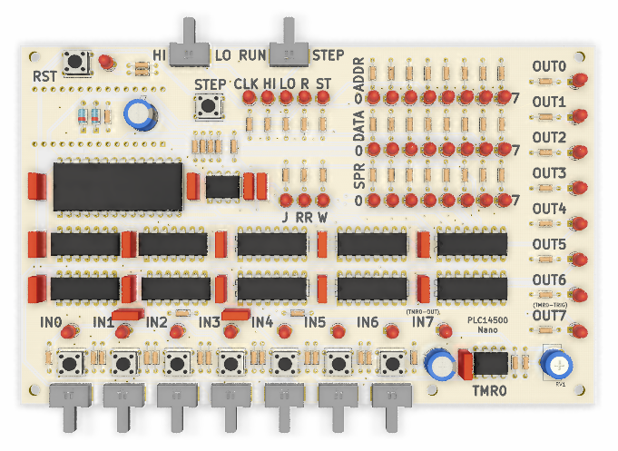
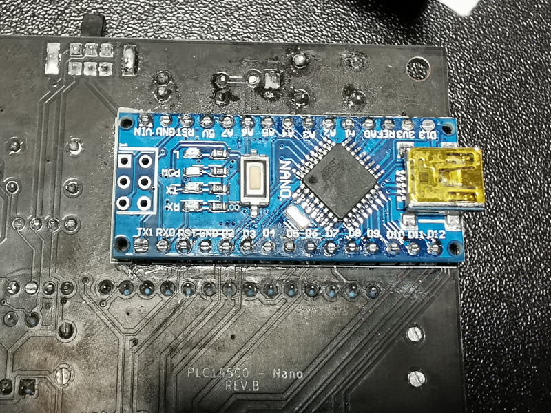

**NEW!** You can now buy this as a ready to assemble kit on [tindie.com](https://www.tindie.com/products/nicola_cimmino/plc14500-nano-1-bit-single-board-computer-kit).

**NOTE!** When assembling the board make sure the Arduino is installed correctly with its square
pad matching the square pad on the PCB. Refer to this [photo](documentation/arduino_installation.png) for correct orientation.

# Introduction

The PLC14500 Nano is a retro-style trainer board intended for the user to familiarize with the Motorola MC14500 1-bit
ICU (Industrial Control Unit), PLCs and Ladder Logic. The board has abundant LEDs that show the status of 
the system buses and registers. This, combined with the possibility to run the software step by step,
gives the user a great deal of insight into how their programs are executing. The slow clock mode 
makes instead for a mesmerizing light show that won't fail to impress when the board is parked on a desk,
waiting for the next coding adventure.

Main features:

* 256 Bytes of program RAM (can be replaced with an EEPROM)
* 7 Inputs each with toggle and momentary switch capability
* 7 Outputs (LEDs)
* 1 Timer mapped to the I/O bus (0.5 to 11s, adjustable via a trimmer)
* 7 bits scratchpad RAM
* 3 clock modes (fast, slow, manual step)


True to its retro style PLC14500 Nano sports exclusively through-hole components and chips in DIP packages.
You might notice an intruder in the Bill of Materials, an Arduino Nano! It's there purely to act as a
bootloader, with a convenient USB interface that surely is easy to connect to modern PCs. However,
to not spoil the illusion, the Arduino is mounted on the bottom side of the PCB, so it won't be visible when 
using the board.



This project is Open Source Hardware [Certified](https://certification.oshwa.org/pl000011.html)


# Assembling the board

To keep the assembled board visually free from clutter, and to give more prominence to the labels
relevant in regular use, it was chosen to hide the component reference numbers on the silkscreen.
Where possible these are on the silkscreen under the component itself but, where not possible, 
these have been omitted completely. To help with the assembly please refer to the assembly view 
available in the `board` folder.

**NOTE** Make sure you refer to the right revision of the board matching the one you have. The board
revision can be found on the bottom side silk screen (eg `PLC14500 Nano REV.A`)

As usual start from the lower profile components (such as resistors and ICs), and work towards taller
profile ones, to finish with large caps and the trimmer. 

**NOTE** The Arduino Nano is to be assembled on the bottom side of the board, opposite the components,
as indicated in the silk screen. Also, make sure D40, D51, R54, C7 are soldered BEFORE you solder the 
Arduino as their PINs are under the Arduino board.



# Getting started

Download the latest toolchain (Windows only at the moment) from this Git repo [releases folder](https://github.com/nicolacimmino/PLC-14500/releases) and unzip it.

Before starting writing your programs and testing them on the board, you will need to flash the bootloader
into the Arduino. This can be easily done with the Arduino IDE. Load the sketch `bootloader.ino` from  the
release zip and make sure the board selected in the Arduino IDE is "Arduino Nano". Connect the board to your PC 
with a USB cable and select, in the Arduino IDE, the new serial port that will be assigned to the board. 
Upload the sketch and you are ready to go. Take note of the serial port name as you will need it to flash the
programs later.

Unless there will be an update to the bootloader you won't need to repeat this step in the future.

# Assembling a program

You can write your programs in a text editor of your choice, as long as you save them with a `.asm`
extension. This is a first example program to make sure your board is correctly assembled and functioning.
You can find this code also in the release zip file under `examples\smoketest.asm`.

````
.board=PLC14500-Nano

; *************************************************
; Prepare:
; All inputs off except IN6 (master switch).
; *************************************************

IEN IN6   ; IN6 acts as master switch
OEN IN6   ; to enable/disable all I/O

; *************************************************
; Test: Input and outputs are working correctly

LD  IN0   ; Load IN0,
AND IN1   ; logical AND it with IN1
STO OUT0  ; and show the result in OUT0.

; Expect: OUT0 is on only when both IN0 and IN1 are on.
; *************************************************

; *************************************************
; Test: TMR0 is working correctly

LD  IN2   ; Load IN2
STO OUT7  ; use it to trigger TMR0.

; Expect: Clicking IN2 on turns on IN7 (TMR0 output)
;   and, after few seconds, IN7 returns off.
; *************************************************

; *************************************************
; Test: Scratchpad RAM is working correctly.

LD  IN3    ; Copy IN3 to SPR0
STO SPR0

LD  SPR0   ; Copy SPR0 to SPR1
STO SPR1

; Expect: Clicking IN3 turns on SPR0 and SPR1
; *************************************************

JMP 0     ; Repeat.
````

Save it to a `test.asm` file and assemble it into a binary with the assembler found in the release zip file:

````
.\asm14500.exe .\test.asm
````

This will produce a `test.bin` file, which should be 256 bytes in size.

# Transferring a program to the board

To transfer the assembled `.bin` file to the board program RAM, make sure the USB cable is plugged in and take note of which serial port 
your board got mapped to in the Arduino IDE. You can then upload the flash command found in the release zip file:

````
.\flash14500 test.bin COM3
````

Replacing `COM3` with the correct port number for your board. Also remember to press the RST button on the board once the upload is done, and verify
that the top switches are in the "HI" and "RUN" positions respectively so the program runs.

# Testing

If you uploaded the above example program you can verify the board correct functioning by following the steps in the sourcecode that will guide you
through the needed settings and actions and expected outcomes.

**Help!!** some LEDs like `J`, `RR` or `W` randomly change intensity when I click other buttons. Do I have have a short somewhere? Did I break something? **no**,
don't worry. This is absolutely normal when the board is running on the normal clock (`HI` and `RUN`), this is because those LEDs are actually flashing on and off
as the MC14500 executes instructions. Because of the high clock speed you don't see the actual flickering but the resulting intensity depends on how often your program
causes them to be on (and for this reason, depending on the program, this is dependent on status of the inputs). This is also true for the `ADDR`, `DATA` and `SPR` LEDs when running with full clock. To convience yourself about this, and for a cool blinking effect, turn the clock to `LO` and watch, just don't expect outputs to react to your clicks promptly!

# What's next

Read more about the assembler and the `.asm` file syntax in the assembler folder [README.md](assembler/README.md).

To get started with programming your board and for some ideas of new programs you can try to make yourself, read the [Programmers Guide](assembler/programmers_guide.md).

If you find any issues, or want to contribute code/comments please feel free to use the "Issues" tool here on GitHub.


