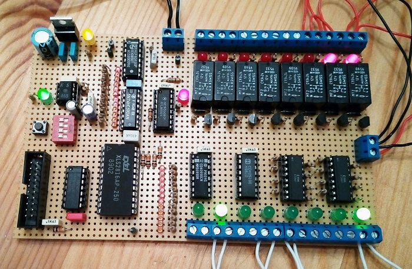

Many years ago I came across an article on an electronics magazine that presented a little circuit based on the Motorola MC14500 1-bit ICU (Industrial Control Unit). The circuit was very simple and allowed to control the ICU manually through a set of dip-switches and buttons. I never bothered to build it, though I got fascinated by the simplicity of the ICU and the 1-bit idea. The simple circuit though didn't convince me as it didn't sound much fun to give the instructions one by one everytime you wanted to execute a program. Reading more about the MC14500 I started to think it would have been cool to make a simple PLC based on it. Since then I never really got around doing it but the schematic somehow came clear in my head, yes I do see things sometimes :) Till this weekend I finally set down to actually wire wrap it.

[Full size photo](https://raw.githubusercontent.com/nicolacimmino/PLC-14500/master/documentation/board_full.jpg)

## Hardware 

The board is now fully functional, after spending few hours to find a glitch and a couple of shorts and broken connections fixed. The glitch was on the control logic of the ouput latch and it quite surprised me since I have layed out this part exactly as it appears in many application notes of the time. More info about this below.

I am in the process of creating the schematic, for now just know that there is fundametally an 8 bit counter working as Program Counter (PC), a 2K EEPROM with the higher 3 address bits controlled by a DIP-switch to allow 8 different programs, the actual MC14500 ICU, a CD4099 as output latch and a CD4051 as input selector. The rest is glue logic and some optocouples and transistors to drive the realys.

I am clocking the board at the moment at few hundred hertz, which gives reasonable response time as the programs are naturally short. There is DIP-switch allowing to running to few hertz so you can see the lights on the buses and control lines moving.

EEPROM programming happens through the 20 pins header where all data and address lines, along with write enable and programming signals are available. 

## Compiler

I whipped up an extremely basic assembler to avoid myself the trouble of maually write the code bytes, which is in truth very simple as there are no indexing modes or other varialble lengths opcodes. You can find the code in "Compiler" folder. This is a C# application and will simply allow you to paste source code into the text window and have it assembled and send over serial to the programmer. Note that the seial port is hardcoded to COM4, adjust for your needs.

## Programmer

The programmer is an Arduino Nano that will just wait for a fixed size, 256 bytes, block of data and send it to the programming header with the needed control signals. The write time is at the moment 15mS per byte which should satisfy all types of EEPROMs.

## Program Example

Below is an example of a test program I wrote just to try things out, the comments should be clear enough to walk you through. This is actually the application you can see in this [video](https://www.youtube.com/watch?v=2l-q3JkEEqE)

    ;
    ; This program implements a simple control
    ; logic for an hypotetical machine with the
    ; following controls:
    ; 
    ; X1 on/off switch controls the machine power
    ; X3 start button
    ; X4 stop button
    ;
    ; Y5 Yellow lamp, indicates machine is started
    ; Y6 Green lamp, idicates machine is ready
    ; Y7 Red lamp, indicates machine power is on
    ;
    ien 7   ; Enable inputs, 7 is hardwired to 1 
    oen 7   ; Enable outputs
    ld 1    ; Load X1 (Master)
    sto 7   ; Set Y7 (Power Lamp, red)
    ld 3    ; Load X3 (Start button)
    or 0    ; OR with X0 (wired to Y0, latch)
    andc 4  ; AND with X4 negated (stop button)
    and 1   ; AND with X1 (Master)
    sto 5   ; Set Y5 (Running Lamp, yellow)
    sto 0   ; Set Y0 (wired to X0, latch state)
    xnor 6  ; Negate, X1 is always zero
    and 1   ; AND with X1 (Master)
    sto 6   ; Set Y6 (Ready Lamp, green)
    nopf    ; Reset and jump to start

The eqivalent ladder diagram woul look something like this:

     |                        |
     |   X1       Y7          |
     +---| |------( )---------+
     |                        |
     - X1                     |
     _                        |
     |      X0       Y0   Y5  | 
     |--+---| |----+-( )--( )-+
     |  |          |          |
     |  +-| |--|/|-+          |
     |    X3   X4             |
     |                        |
     |   X0       Y6          |
     +---|/|------( )---------+
     |                        |
     

## Timing issue

At the first trial of the board I had timing issue when driving the CD4099, the output latch. Whenever I stored a value into one output it would get stored also on zero and, apparently in random way also in other outputs as well. After discarding eventual shorts or plain wrong wiring I set to analyze the timing on the CD4099 controls. And to my surprise I found out that the MC14500 write line, which goes into the /E line of the 4099, after being negated was staying high for a short moment while the address line was changing. In the capture below the blue line is the first address line to the 4099 and the yellow one is the /E signal. You can see that the first falling edge of /E is actually after the address transitioned from 1 to 0 (sorry not the best timebase to make it evident but it's there few pixel delay).

According to the 14500 datasheet there is a short transient time after the clock cycle following the STO begins before the WRITE line goes low, of course the not gate also added a bit delay but I am puzzled I haven't seen anything about this in any of the MC14500 example schematics from the time, so maybe it's an issue popping up by mixing different types of components (the 4099 was not in the example scheatics of the time). Anyhow, since the 4099 doesn't latch on the edge but on level of the /E pin I created a simple monostable that generates a short low pulse when the write line transitions from low to high and used that pulse to drive the 4099 /E pin so, in fact, I made it latch on the edge. This solved the issue. The monostable is simply a CR feeding a NOT gate as seen below.

The capture above instead shows the MC14500 WRITE line in blue and the output of the monostable feeding into the /E of the 4099 in yellow. As you can see there is just a short pulse on the rising edge of WRITE.
