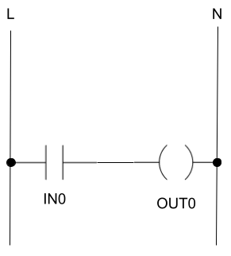
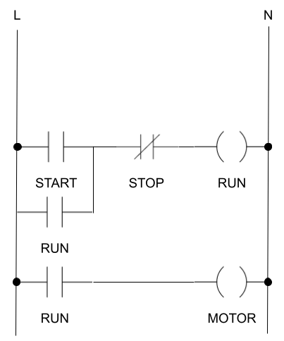

# PLC14500 Programmmers Guide

In this guide I will assume you are familiar with Ladder Logic diagram symbols. If these are new to you, I suggest you
first familiarize with the symbology. One good starting point is this
Wikipedia [article](https://en.wikipedia.org/wiki/Ladder_logic).

I will also assume you have assembled and tested the board following the instructions in the [READ.me](../README.md)
file.

## Reading Inputs and controlling outputs

In this first example we will be simply reading the status of one of the inputs and mirroring it to an output. A ladder
diagram for such application would look something like this:



This can be translated to MC14500 assembly (with some extra code, we will get to that in a moment).

````
.board=PLC14500-Nano

IEN IN6
OEN IN6

LD  IN0
STO OUT0

JMP 0
````

The `.board` directive is metadata that serves the purpose to tell the assembler on which type of board we want to run
our code. This will have an effect on the generated bytecode as well as will provide relevant errors should some part
of the program make use of features not available in a certain board type.

The next two instructions `IEN` and `OEN` are the two intruders that don't appear in our ladder diagram. These
instructions
stand for `Input ENable` and `Output ENable`. They are a powerful construct that allows to build conditionals that, in
practice, surf over (skip) a block of code. But, for the time being, let's not digress into this. At this stage it's
enough to know that, after reset, the MC14500 "disables" its input and output or, in other words, ignores any actual
value read from the inputs and any write operation to the outputs. This is a bit unfortunate as it means we must have
such instructions in every program or the program would do nothing at all. For simplicity, we tell the MC14500 to
enable input/output operations on the status of input IN6, so we will need to make sure this is flipped to ON.

The next to lines are the actual representation of our ladder diagram. The `LD` instruction will load the value of IN0
into the only register `RR`. After this, `STO` will store the value in `RR` into `OUT0` so, in practice, OUT0 will
reflect the status of `IN0`.

The last instruction `JMP 0`, jumps at the start of the program. **Note!** The PLC14500-Nano doesn't have a pre-settable
Program Counter, for this reason it allow jumping only to 0. The assembler will error if you try to do otherwise.
However, worry not, with the `IEN`/`OEN` instructions and the `SKZ` conditional there are plenty of options to have more
complex flows than just a single loop.

Let's go ahead and assemble the program. I'm assuming here you downloaded the release zip and unzipped it on a folder
`C:\plc14500`, adjust your paths if needed:

````
asm14500.exe examples\example1.asm
````

If you now look into the `examples` folder you should have a 256-bytes file named `example1.bin`. The file is 256 bytes
because that's what the bootloader of a PLC14500-Nano expects, your program is just 5 bytes long, the rest has been
padded
with `0x0F`. You can see this with a binary editor:

````
Offset(h) 00 01 02 03 04 05 06 07 08 09 0A 0B 0C 0D 0E 0F
00000000  EA EB 81 88 0C 0F 0F 0F 0F 0F 0F 0F 0F 0F 0F 0F  êë.ˆ............
000000E0  0F 0F 0F 0F 0F 0F 0F 0F 0F 0F 0F 0F 0F 0F 0F 0F  ................
.....
000000F0  0F 0F 0F 0F 0F 0F 0F 0F 0F 0F 0F 0F 0F 0F 0F 0F  ................
````

Before we can test the program on the board we will need to identify which COM port gets assigned to our board. Also,
ensured you followed the board assembly instructions and burned the bootloader into the Arduino Nano. The easiest way
to find out the right COM port is to open the Arduino IDE, open the `Tools\Port` menu and take a note of what ports
are available (possibly none), then plug in the PLC14500-Nano and check again `Tools\Port` to determine the new one
that appeared. In this guide I will assume `COM3`, adjust examples as needed.

Let's now load the assembled program to the board:

````
flash14500.cmd examples\example1.bin COM3
````

You should see the `ADDR` and `DATA` LEDs on the board flashing for a few seconds, wait the command to complete and then
press the `RST` button on the board to ensure it's running. Also make sure the two switches on top are set to `HI` and
`RUN` respectively. This ensures the clock is running at normal speed.

To test the program make sure `IN6` is switched to on (remember, this reflects the input/output enable of the MC14500),
if you now press momentarily the `IN0` button you will notice the `OUT0` LED will follow.

Go ahead and turn off `IN6`, now regardless of the state of `IN0` the `OUT0` will not change.

Congratulations! You wrote your first PLC14500 assembly program! In truth, it could be the second if you did the
smoketest
in the assembly instructions, but this is the first one you, hopefully, understand.

## Logic operations

At this stage you might be thinking: surely that was a lot of soldering and typing to just get a LED controlled by a
button, I know how to do that with a button and a LED! And you are right, it gets worse though. The next example won't
change things much, it will show what you could do with two buttons and a LED. However, this will provide the foundation
for more advanced setups not achievable by wiring alone.

The MC14500 provides instructions to perform logical operations. All logical operations are performed between the `RR`
register value and the input value provided as argument. Below is an example program that will switch on `OUT0` only if
both `IN0` and `IN1` are on.

````
.board=PLC14500-Nano

IEN IN6
OEN IN6

LD  IN0
AND IN1
STO OUT0

JMP 0
````

This is actually very similar to the previous example, just with the addition of the `AND IN1` line. This command will
take the value currently in the `RR` register (`IN0` in this case) and do a logical `AND` with the value in `IN1`, the
result will be stored in `RR` and, on the next line, stored in `OUT0`.

If you assemble and load the program above you will notice you need to have both `IN0` and `IN1` on for `OUT0` to go on.

There's not much point in providing examples for other logical operations, there will be many occasions later on, to use
them directly in various applications. I will just list below all logical operations provided by the MC14500 for
reference.

| Instruction |                   |
|-------------|-------------------|
| AND         | RR = D AND RR   |
| NAND        | RR = !Data AND RR |
| OR          | RR = Data OR RR   |
| ORC         | RR = !Data OR RR  |
| XNOR        | RR = !(Data XOR RR) |

## Latch and Reset

With the next example things will start to get more interesting and will move a step further than something that can be
achieved by just wiring buttons and LEDs. From here I will start also to introduce the examples in terms of real life
applications instead of abstract "the output will be on when this and that happens".

For this example we will consider a common scenario in industrial machines where we have a motor controlled by two
buttons,
one to start it and one to stop it.

I will take the occasion of our first real-life scenario, to digress and introduce a feature of the assembler that will
make your programs easier to understand and maintain. The assembler metadata allows to provide friendly names for the
inputs and outputs of the board, these names can then be used throughout the code instead of the input/output names.
This
will not only make the code much easier to read and understand, it will also allow to change the inputs/outputs assigned
to each function a breeze with no risk to forget to change them somewhere in the code.

Friendly names are declared in the assembly file like this:

````
.io_SWITCH_A=IN0
.io_SWITCH_B=IN1
.io_MOTOR=OUT0
````

This will then allow us to use them throughout the code like:

````
LD SWITCH_A
AND SWITCH_B
STO MOTOR
````

We will see a practical usage soon, but before we can implement our machine control buttons there's one more notion I
need
to introduce which is the Scratchpad RAM (`SPR` in short). The `SPR` is composed of 8 bits mapped as inputs and outputs
where the outputs are always looped back to their respective inputs. In other words, if you write something to `SPR0`
you
can read it back later on in the program. This is not true for `IN` and `OUT` that are not looped back (writing a value
in `OUT0` doesn't affect `IN0`, as one would expect.). The `SPR` is useful to store values we want to persist and use
in different parts of our program.

The ladder diagram for an industrial motor start/stop contol would look like this:



`START` is our start button and `STOP` the stop button. `MOTOR` is, you guessed it the motor. Things get interesting
with `RUN`. This is not an actual button or actuator, this represents what you would achieve with a relay. When the coil
of the hypothetical `RUN` relay is energized the `RUN` contactor would be closed. This, in practice, will keep energized
the `RUN` relay coil even when `START` is released. This allows us to achieve one of the goals: latch `RUN` when `START`
is pressed. The `STOP` button (normally closed), will de-energize `RUN` when pressed and, as a consequence, reset the
latch
completing the needed functionality. The bottom rung in the ladder simply applies the `RUN` contactor to the motor.

As you might have guessed by now, `RUN` is neither an input nor an output, it's just a value we need to store and, as
we just learned, the `SPR` is there exactly for this purpose. The code below implements the described start/stop logic.

````
.board=PLC14500-Nano
.io_MASTER=IN6
.io_START=IN0
.io_STOP=IN1
.io_RUN=SPR0
.io_MOTOR=OUT0

IEN MASTER
OEN MASTER

LD START
OR RUN
ANDC STOP
STO RUN

STO MOTOR

JMP 0
````

I won't go into too much detail of the code as the operations are like those described previously. What is to be noted
is the usage of `RUN` (which is a label for `SPR0`) to store the status of the motor. If you assemble and load this
program you will notice that when you press `IN0` the output `OUT0` will go high. Take a moment to look at the `SPR0`
LED as well and notice how it also goes on. Pressing again `IN0` (`START`) doesn't to anything, however
pressing `IN1` (`STOP`) will switch off `OUT0` (`MOTOR`) as well as `SPR0`.

Now that you have a bit more complex program take a moment to familiarize with the step of moving from a ladder diagram
to the assembly code. You might have jumped on the chair when, above, I said "and this ladder diagram can be written as
this program", I won't blame you. However, if you look closely at the first rung `START` and `RUN` are in parallel, this
means they are passing current if one OR the other is on (`LD START` `OR RUN`). Moving towards the right of that same
rung we see that current flowing though `START` or `RUN` can't reach the `RUN` coil if `STOP` is pressed (it's a Normal
Close contact), so we need `ANDC STOP` (if stop is on, ie pressed, we will do an AND with the complement which is off,
this will always result in off, regardless of the status of `START` and `RUN`).

With a bit of exercise you should be able to read the ladder diagram from top to bottom and type accordingly the
assembly code.

